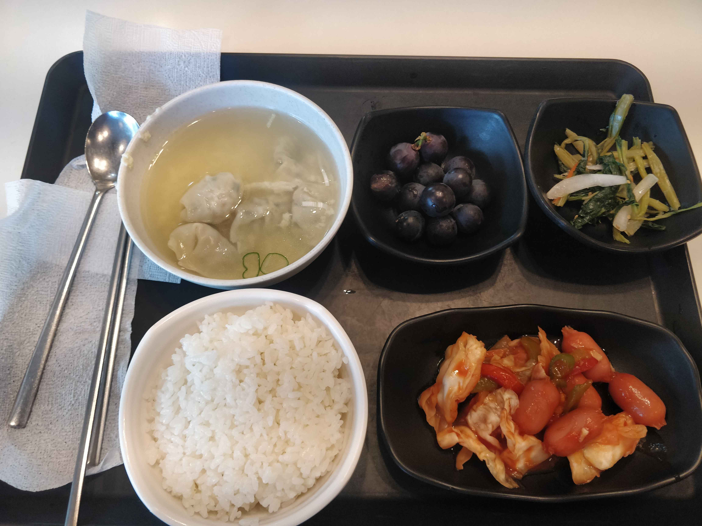
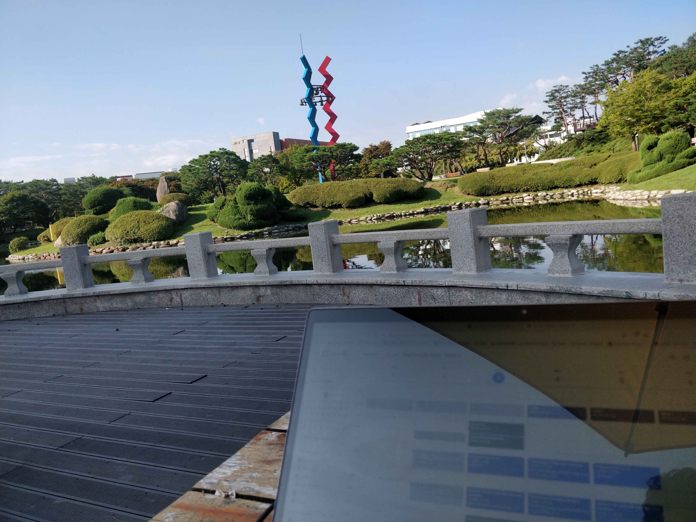

# Day in the life (04/09/2024)

**7:20** : Le réveil sonne. Je me prépare tranquillement pour aller prendre mon petit-déjeuner dans une cafeteria qui se situe en plein centre du campus.

**8:00** : Après une petite quinzaine de minutes de marche, j'arrive devant la cafeteria. Je paye et je vais chercher les différents plats qui vont composer mon plateau. Pour 3000 Won (~2e), c'est vraiment bon 👌.

**8:30** : Je me pose sur une table à l'extérieur, en face d'un point d'eau prénommé le *duck pond* (littéralement, la mare aux canards). Je sors mon ordinateur pour passer en revue ma journée et voir si j'ai des choses à préparer pour mes cours du jour. Aujourd'hui, je commence d'abord par vous écrire ces quelques lignes.

**10:00** : Je vais en cours. Le bâtiment se situe à une quinzaine de minutes de marche encore une fois (le campus est grand, il faut beaucoup marcher 🏃‍♂️). Au moins, ça me permet de faire mes 10 000 pas quotidiennement.

**10:30** : Aujourd'hui, je commence par un cours qui s'intitule : *Foundation of Big Data Analytics*.
Pour faire simple, c'est un cours qui permet de comprendre les bases de comment fonctionne l'entraînement d'une intelligence artificielle.

**11:45** : C'est l'heure de manger. Il y a pas mal de choix sur le campus, avec 12 restaurants proposant tout type de cuisine. Mon choix se porte aujourd'hui sur une cafeteria proche de ma résidence, puisque mon deuxième cours de la journée est à distance.
Pour 5000 Won (~3e50), c'est bon et assez copieux.

**13:00** : Je commence mon deuxième cours de journée, qui traite de la sécurité des systèmes émergents. Le cours est exceptionnellement à distance cette semaine car mon professeur est en déplacement à Singapour pour une conférence sur "les systèmes d'espionnage développés par les états". Plutôt intéressant, quoiqu'un peu effrayant. L'objectif de ce cours est d'étudier des papiers de recherche, d'en faire des résumés et de les présenter.

**15:00** : Après l'effort, le réconfort : c'est l'heure du sport 🤣.

**16:30** : Un peu de travail sur mes cours du jour pour bien finir la journée.

**18:00** : En Corée, on mange très tôt. 18 h, c'est même déjà un peu tard. Je vais manger un sandwich avec un ami avant d'aller à un concert en plein air. C'était assez sympa, il y avait même des burgers gratuits.

**22:00** : La journée est terminée, c'est l'heure de dormir un peu.

Voilà un petit aperçu dans ce qui va être, je pense, une de mes journées type pour ces quatre prochains mois.

