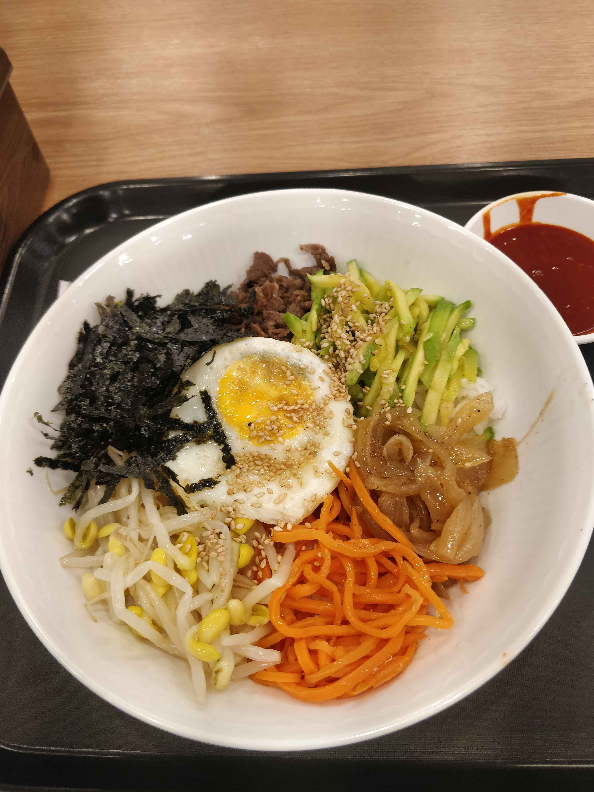
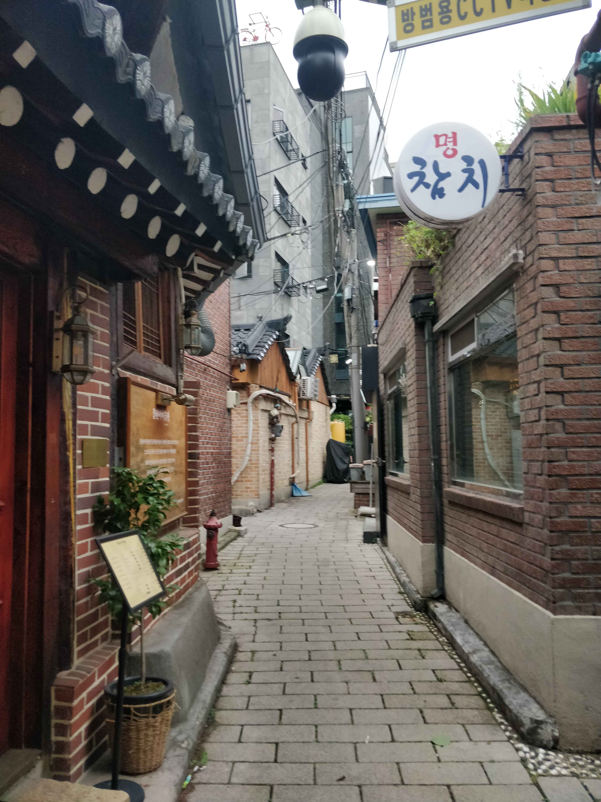
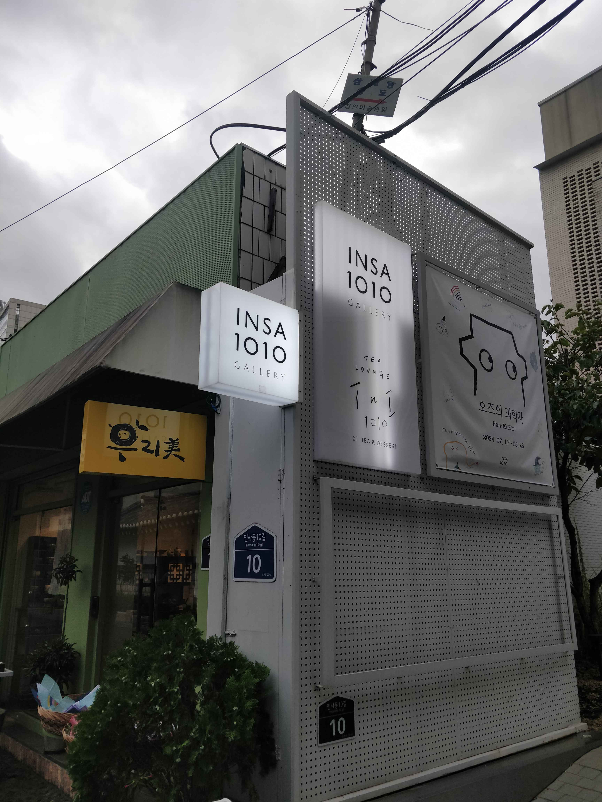

Après une nuit peu reposante, faute à un matelas d'un autre temps, je pars de nouveau en mission pour aller chercher une carte SIM. Je retourne donc au magasin que j'avais repéré la veille. Ils me disent qu'ils ne vendent pas de carte SIM et qu'il faut que j'aille au magasin principal. Ils me montrent une carte qui a l'air plutôt simple suivre : tout droit sur l'avenue principale pendant une dizaine de minutes, puis à gauche au carrefour. Je continue donc mon périple vers ce fameux magasin. Après avoir suivi les instructions à la lettre, je ne le trouve pas. Je regarde donc sur Kakao Maps (le Google Maps Coréen) où peut donc se situer ce magasin KT Mobile. Je me dirige vers le plus proche. Il n'a pas l'air bien différent de celui dont je viens. Ils me disent que je peux obtenir une carte SIM dans le magasin juste au-dessus, au troisième étage. Je m'y rends donc. Le magasin n'a rien à voir avec celui du rez-de-chaussée, mais tant qu'ils me donnent une carte SIM, ça me va. La procédure est assez simple, je ressors 25 minutes plus tard avec une SIM 🙌. Mission numéro une accomplie. Il faut maintenant aller manger.

Je continue à me balader dans une des rues qui semble être une des rues commerçantes principales du quartier. Je trouve un restaurant qui me plaît et j'y mange mon tout premier Bibimbap 🍚.

Repu, je continue mon exploration de la ville pour le reste de l'après-midi.

Fatigué, je décide de rentrer. Il faut donc que je me confronte au métro. J'essaye de prendre un ticket à usage unique, mais je peux uniquement payer en cash, et en petites coupures 😑. Il faut donc que je me procure une carte T-money, trouvable normalement dans toutes les bouches de métro. Je trouve la machine, elle est en panne. Je cherche alors un "convenience store" (petit magasin d'appoint). Il y en a un dans absolument toutes les rues en Corée, j'en trouve donc un assez facilement. Après plusieurs tentatives infructueuses, j'arrive finalement à trouver cette fameuse carte qui me permettra d'utiliser les transports en commun dans toutes les villes de Corée. Il doit être environ 19 h 30, je peux enfin rentrer me reposer.

Sur le retour, je passe prendre des nouilles dans un Seven Eleven, ce qui fera office de dîner.

C'est ainsi que s'achève cette deuxième journée passée à Séoul. Demain, [direction Daejeon !]()
