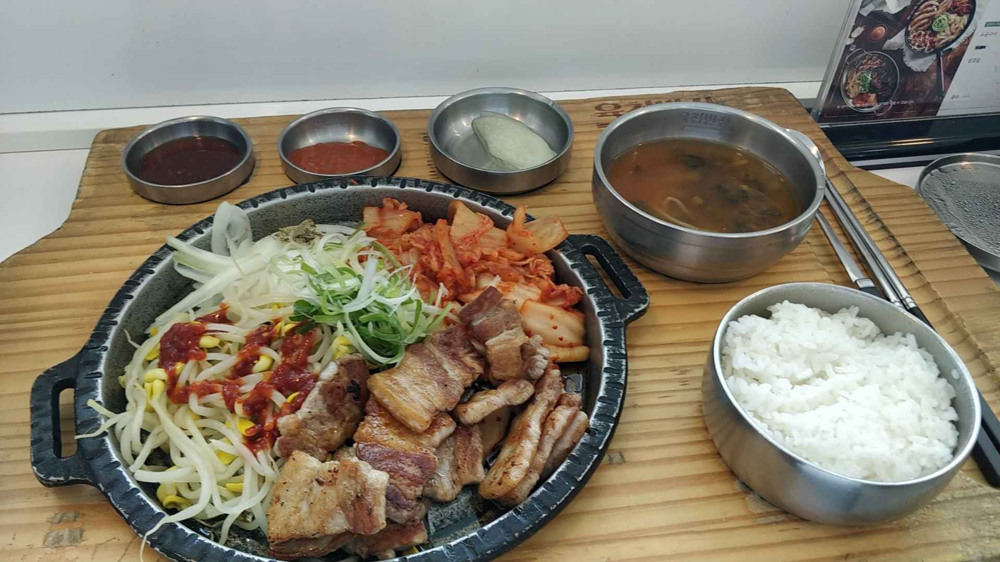
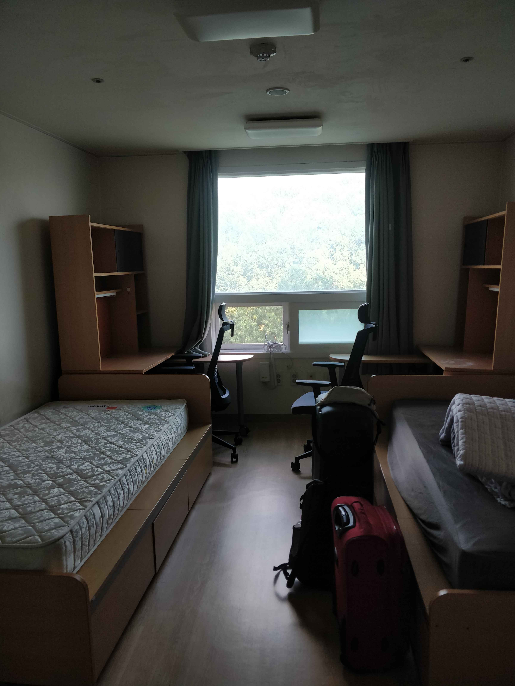
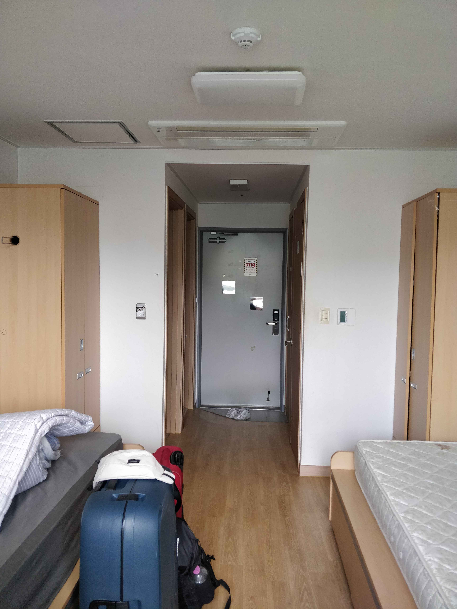

# Troisième jour : welcome to Daejeon (대전)

Après ces quelques jours a Séoul, me voilà parti pour Daejeon. La ville se situe en plein cœur de la Corée. C'est donc après à peine une heure de KTX (TGV Coréen) que je me retrouve dans la gare de Daejeon. Il est 15 h, je me dirige dans un restaurant de la gare pour reprendre des forces.

Une fois rassasié, je prends le métro, puis le bus pour un total d'environ une heure de trajet pour me retrouver sur le campus universitaire de l'université de KAIST (Korea Advanced Institute of Science and Technology). Je marche pendant environ un quart d'heure pour rejoindre ma résidence. Il fait chaud. Très très chaud. Une fois arrivé, je m'annonce auprès du responsable de la résidence, il me donne des draps et une couverture pour dormir et il m'amène jusqu'à ma chambre qui se situe au 11e étage du bâtiment.

Niveau propreté ce n'est pas ça, mais ça pourrait être pire. Je descends donc à la petite supérette du rez-de-chaussée pour acheter de quoi laver, et je passe le reste de mon après-midi à laver frénétiquement chaque recoin de mon espace de vie : bureau, lit, tiroirs, penderie, salle de bain, toilettes, murs noircis par la crasse, tout y passe.

Le soir, je retrouve d'autres Français de l'INSA qui sont dans la même résidence que moi pour manger un repas de poulet frit TRÈS épicé. Des larmes de douleur ont coulé sur le poulet pendant ce repas 🤣.

Et voilà qui s'achève cette première journée à Daejeon. Je n'ai pas eu l'occasion de beaucoup voir la ville, mais le campus est très accueillant. Mon colocataire n'est pour l'instant pas arrivé, je suis donc seul dans ma chambre, ce qui me convient bien 😃. En espérant qu'on s'entende bien.

[Cliquez ici](troisieme-jour-welcome-to-daejeon.md) pour découvir la prochaine aventure.

<!-- Changer le lien-->
